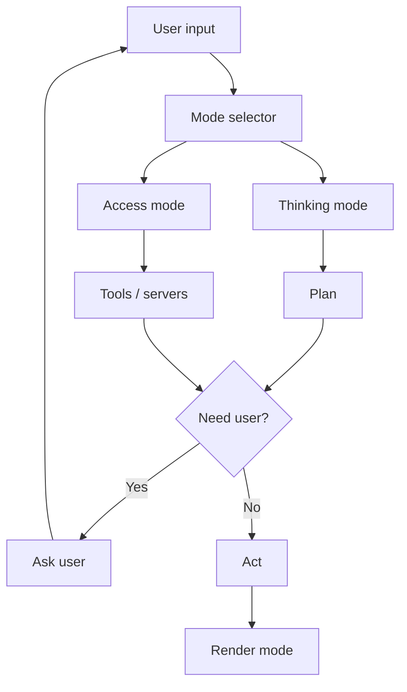
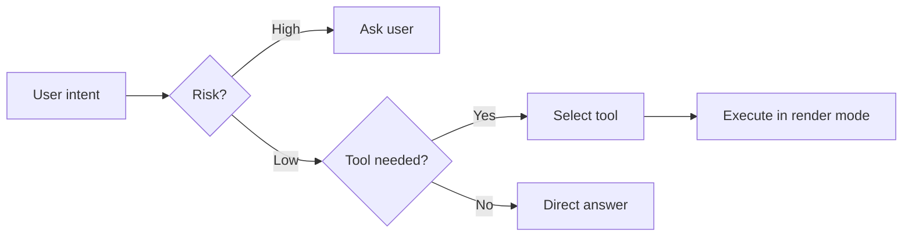

# The Agent Guide

The agent guide is the behavior contract that tells the agent how to think, when to access files or servers, and where to ask the user before acting.

## Core Concerns

| Concern | Question it answers |
|---|---|
| Thinking mode | How deeply should the agent reason? |
| Access mode | What can the agent touch? |
| Decision boundary | When must the agent stop and ask? |
| Mode selector | How does the agent pick the right mode? |

## Thinking Modes

| Mode | Use when | Example |
|---|---|---|
| Fast | Quick, factual, low-risk | Answer a syntax question |
| Deep | Complex reasoning, planning | Design a refactor |
| Coding | Writing or editing code | Implement a function |
| Reasoning | Trade-off analysis | Compare two architectures |
| Planning | Multi-step tasks | Migrate a database |
| Silent | No visible reasoning | Simple file read |

The agent announces the active mode via the chat render state.

## Access Modes

| Mode | What it touches | Risk level |
|---|---|---|
| Local files | Read/write files in the workspace | Medium |
| Shell | Run commands on the user's machine | High |
| External APIs | Call third-party services | High |
| MCP servers | Model-context-protocol tools | Medium |
| Browser / computer | Visual automation, screenshots | High |
| Memory | Past sessions, saved context | Low |

## Decision Boundaries

Always ask before:

- Writing or deleting files outside the agreed scope
- Running shell commands that mutate state or use secrets
- Calling external paid APIs or services
- Sharing code or data outside the workspace

Never ask for:

- Read-only exploration of the workspace
- Showing reasoning or intermediate plans
- Render-only updates (progress indicators)

## Mode Selector Logic

## Anti-patterns

- Switching modes without telling the user.
- Mixing secrets in plain text with other composer input.
- Hiding tool calls behind a generic "thinking" state.
- Continuing past a checkpoint without explicit approval.
