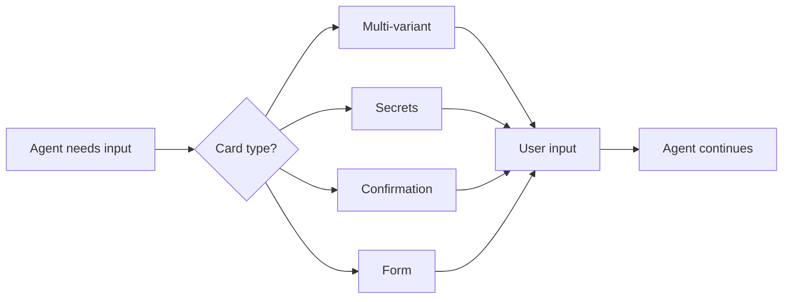
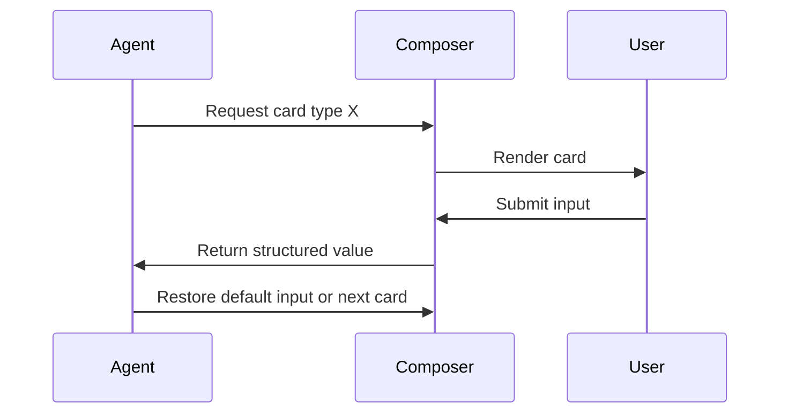

# Custom Composer Cards

A composer card is a focused input widget that temporarily replaces the default chat input when the agent needs a specific kind of input from the user.

## When to Use a Composer Card

- The user must choose from a short list of options.
- The user must provide secrets or credentials.
- Structured input is safer than free text.
- The agent needs confirmation before a risky action.



## Card Types

### Multi-variant

Presents several mutually exclusive options for the user to pick one.

```
┌─────────────────────────────┐
│  Choose an approach:        │
│  [1] Quick fix              │
│  [2] Full refactor          │
│  [3] Ask me more questions  │
└─────────────────────────────┘
```

Rules:

- Limit to 5 options or fewer.
- Label each option clearly and predict the outcome.
- Allow the user to reject all variants and type free text.

### Secrets / Credentials

A secure input card for API keys, tokens, passwords, or certificates.

```
┌─────────────────────────────┐
│  Enter API key:             │
│  ************************   │
│  [Use once] [Store] [Cancel]│
└─────────────────────────────┘
```

Rules:

- Mask input by default.
- Do not log the secret value.
- Offer session-only use by default.
- Require explicit opt-in to store.
- Show which scopes the secret will be used for.

### Confirmation

Binary or multi-option approval before a destructive or expensive action.

```
┌─────────────────────────────┐
│  Run `rm -rf node_modules`? │
│  [Run] [Edit] [Cancel]      │
└─────────────────────────────┘
```

### Form

Structured fields for configuration, settings, or parameters.

```
┌─────────────────────────────┐
│  Environment: [prod    ▼]   │
│  Region:      [eu-west-1▼]  │
│  [Submit] [Cancel]            │
└─────────────────────────────┘
```

## State Flow



## UX Notes

- Cards should be dismissible with `Esc`.
- A card is the agent's "question" to the user; keep it one step at a time.
- After submission, show the answer in the chat transcript.
- Secrets should appear as `[secret]` in the transcript, never the raw value.
