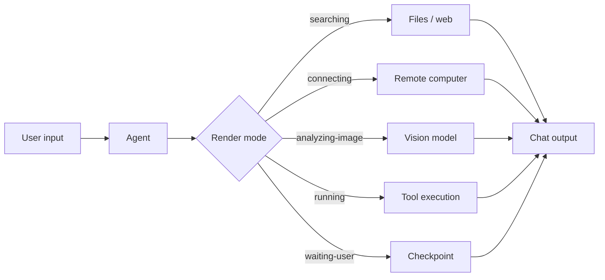

# Chat Render Modes

Render modes are visual states shown in the chat while the agent is working. They replace or augment a generic "thinking" indicator with specific, meaningful feedback.

## Built-in Render Modes

| Mode | Meaning | Visual cue |
|---|---|---|
| `searching` | Looking through files, docs, or the web | Magnifying glass / file scan |
| `thinking` | Reasoning, planning, comparing | Spark / brain icon |
| `connecting` | Connecting to a remote computer or server | Plug / network icon |
| `analyzing-image` | Processing an image or screenshot | Eye / frame overlay |
| `generating` | Writing code, text, or a plan | Pencil / code block |
| `waiting-user` | Paused at a checkpoint or question | Pause / hand icon |
| `running` | Executing a shell command or tool | Terminal / spinner |
| `syncing` | Saving state or summarizing context | Cloud / archive icon |

## Mode Transitions

A render mode can transition to another mode without user input:

1. `searching` → `thinking` → `generating` → `waiting-user`
2. `connecting` → `analyzing-image` → `thinking` → `generating`

The agent should announce the new mode when the underlying work changes.

## Cancellation

Every active mode should expose a cancel action:

- `Stop searching` during `searching`
- `Cancel tool` during `running`
- `Skip step` during a multi-step flow

Cancellation returns the agent to a safe checkpoint, not the default idle state.

## Extensibility

To add a new render mode:

1. Define the mode name, icon, and color.
2. Describe which agent action triggers it.
3. Specify the cancel behavior.
4. Add an accessibility label.

## Accessibility

- Provide an `aria-live` label for screen readers.
- Do not rely solely on color or animation.
- Show a text label next to the icon.

## Performance

- Render modes are lightweight indicators; avoid heavy UI work inside the mode loop.
- Keep tool output and render state separate so the UI stays responsive.
