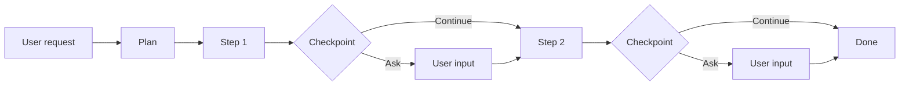
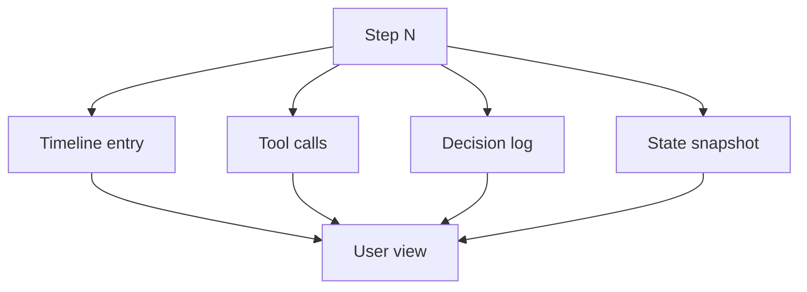
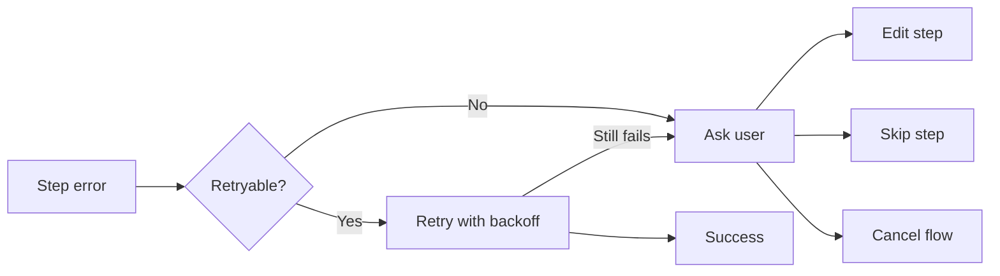

# Multi-Step Flows & Observability

A multi-step flow is a planned sequence of agent actions that may include checkpoints where the agent pauses and waits for the user.

## Flow Anatomy

## Steps and Checkpoints

| Element | Purpose | Can be skipped? |
|---|---|---|
| Step | A unit of work the agent executes | No |
| Checkpoint | A planned pause for user approval or input | No |
| Pause point | Optional stop when confidence is low | Yes |

A checkpoint is a hard boundary. The agent cannot continue past it without explicit user action.

## When to Stop and Ask

Stop and ask when:

- The risk of the next step is high.
- Multiple valid paths exist and the user should choose.
- A step failed and recovery options are unclear.
- A secret, credential, or external resource is needed.
- The user explicitly requested a step-by-step review.

Continue automatically when:

- The next step is read-only or reversible.
- The user has already approved the broader plan.
- The step is part of a previously confirmed sub-flow.

## User Intervention Actions

| Action | Effect |
|---|---|
| Approve | Continue to the next step |
| Edit | Modify the plan or the current step |
| Retry | Re-run the current step |
| Skip | Move to the next step without completing the current one |
| Cancel | Stop the flow and roll back to the last safe checkpoint |
| Expand | Show full reasoning, tool calls, and output |

## Observability

Every step should be inspectable:

### What to Show

- **Timeline**: ordered list of steps, render modes, and durations.
- **Tool calls**: which tools were invoked, with what arguments, and what they returned.
- **Decision log**: why the agent chose a path, including rejected options.
- **State snapshot**: plan, memory, and context at the start of the step.

## Error Handling

## Example Flows

| Flow | Steps | Checkpoints |
|---|---|---|
| Refactor | Read code, plan changes, edit, test, review | Before destructive edits, before tests |
| Migration | Backup, transform, validate, apply | Before each phase |
| Research | Search, synthesize, cite, draft | Before final summary |
| Deployment | Build, test, approve, deploy, verify | Before deploy, after verify |

## UX Notes

- Show the plan before the first step.
- Highlight the current step and elapsed time.
- Allow users to expand any step to see full details.
- Preserve observability data even after the flow is summarized.
