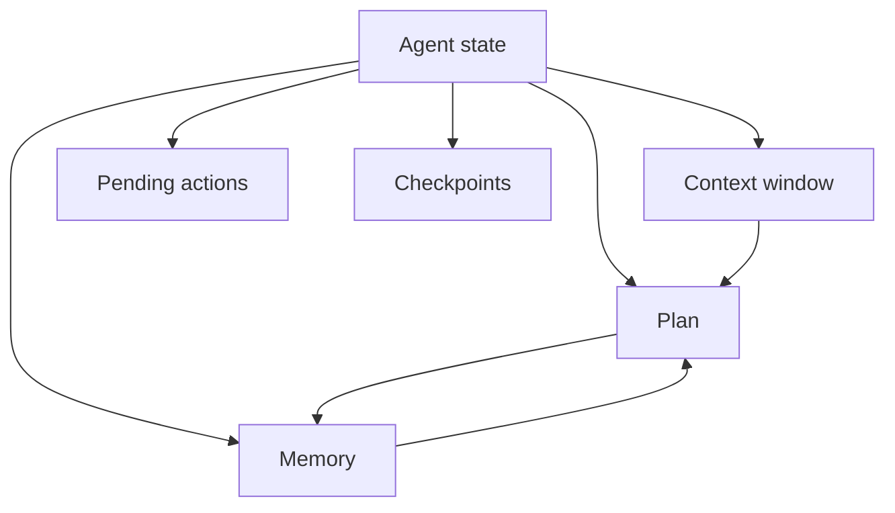
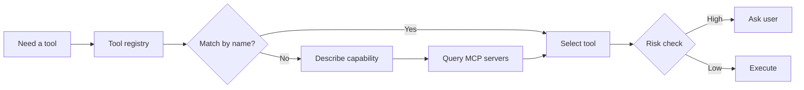
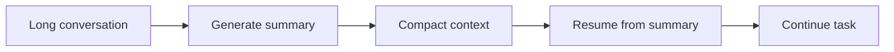

# State, Tool Discovery & Summarization

This document describes how the agent maintains its internal state, discovers and selects tools, decides when to summarize, and resumes from a summary.

## Internal State

| Component | Holds |
|---|---|
| Plan | Goal, steps, current step, status |
| Memory | Long-term facts about the user and project |
| Context window | Recent messages, tool outputs, file reads |
| Pending actions | Actions queued but not yet executed |
| Checkpoints | Safe resume points in a multi-step flow |

## Tool Discovery

The agent finds tools in three layers:

1. **Built-in tools**: file read, shell, search, etc.
2. **Configured tools**: registered tools the user has approved.
3. **MCP servers**: discovered dynamically and requested per use.

When a tool is not available, the agent should describe the capability gap instead of silently failing.

## Decision Making

For every step, the agent evaluates:

- **User intent**: What outcome does the user want?
- **Risk**: Can the action damage data, cost money, or expose secrets?
- **Tool fit**: Which tool has the right capability and scope?
- **Cost**: Time, tokens, API calls, compute.
- **Guardrails**: Is the action allowed by policy?

If the best path is unclear, the agent chooses the lower-risk path and asks the user.

## Conversation Summarization

Summarize when:

- The context window is near its limit.
- A long flow has completed and the user wants a fresh start.
- The agent has accumulated many intermediate tool outputs.
- The user explicitly requests a reset.

## What to Keep and What to Drop

| Keep | Drop |
|---|---|
| Goal and current plan | Full tool output from old steps |
| Key decisions and user preferences | Intermediate reasoning drafts |
| Checkpoints and safe resume points | Render-only updates |
| Open secrets scopes | Expired session secrets |

## Resuming from a Summary

To resume:

1. Load the summary as the new context.
2. Restore the current plan and checkpoints.
3. Rehydrate any pending actions that were not completed.
4. Confirm with the user if the plan is still valid.

## Persistence and Session Boundaries

| State type | Where it lives | Survives restart? |
|---|---|---|
| Plan + checkpoints | Local session | Yes, if saved |
| Memory | User profile | Yes |
| Secrets | Secure vault | Yes, if stored |
| Context window | In-memory | No |
| Tool output cache | Project cache | Optional |

## UX Notes

- Tell the user when a summarization happened.
- Show the summary in a collapsible block so the user can verify it.
- Do not drop pending checkpoints during summarization.
- Allow the user to resume from any saved checkpoint, not just the latest.
