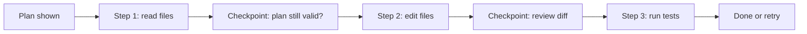
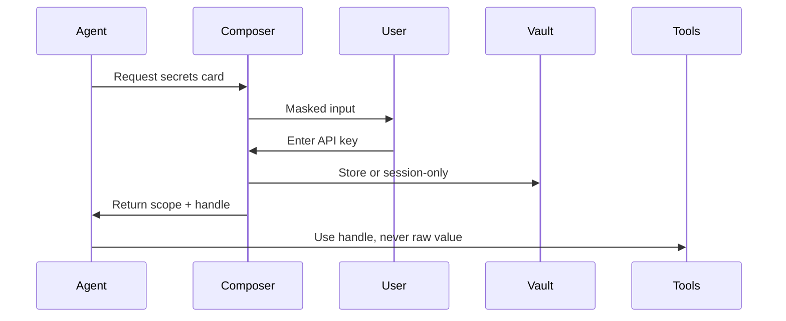
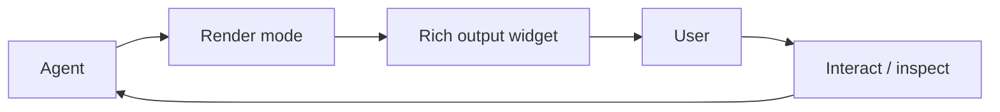
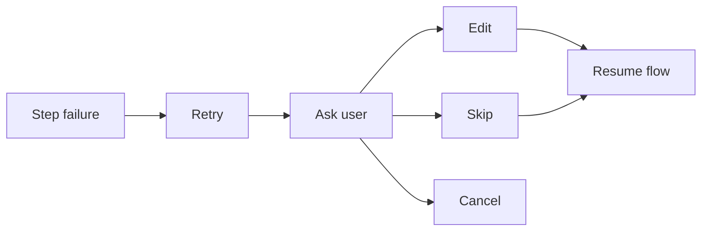
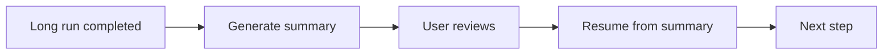

# Cross-Cutting UX Patterns

Patterns that combine thinking modes, access modes, composer cards, render modes, and multi-step flows into complete user experiences.

## 1. Onboarding an Agent to a New Codebase

```mermaid
flowchart LR
  Start[User: "Help me with this repo"] --> Search[searching]
  Search --> Read[Read README, config, structure]
  Read --> Thinking[thinking]
  Thinking --> Plan[Propose plan]
  Plan --> Card[Multi-variant card]
  Card --> Approve[User approves]
  Approve --> Run[Run first step]
```

- The agent starts in `searching` mode.
- It reads key files without asking.
- It presents a multi-variant plan card: "Explore", "Refactor", "Add tests", "Ask more questions".
- The user picks a path and the agent enters a multi-step flow.

## 2. Long Task with Checkpoints



- Show a sticky timeline with current step, elapsed time, and next checkpoint.
- Use `waiting-user` render mode at checkpoints.
- Let the user edit the plan at any checkpoint.

## 3. Handling Secrets Safely



- Never show secrets in the chat transcript.
- Default to session-only; require opt-in for persistence.
- Show which tools will use the secret before execution.

## 4. Rich Intermediate Output

When a step produces useful intermediate output, show it live:

- File diff → inline diff render
- Image analysis → highlighted regions
- Shell output → streaming terminal
- Search results → collapsible file list



## 5. Designing for Failure

Every flow should degrade gracefully:



- Show the failure reason in the decision log.
- Offer a sensible default action (usually retry or skip).
- Preserve the timeline so the user can trace what happened.

## 6. Summarize and Resume



- After a long run, summarize into a compact block.
- Keep the plan and checkpoints intact.
- The user can continue, restart, or branch from the summary.

## Summary of Principles

1. Be transparent about what the agent is doing and why.
2. Stop at boundaries and ask when risk or ambiguity is high.
3. Use structured composer cards instead of free text when precision matters.
4. Render modes turn waiting time into useful feedback.
5. Observability is not optional; it builds trust.
6. State should survive summarization and session boundaries.
