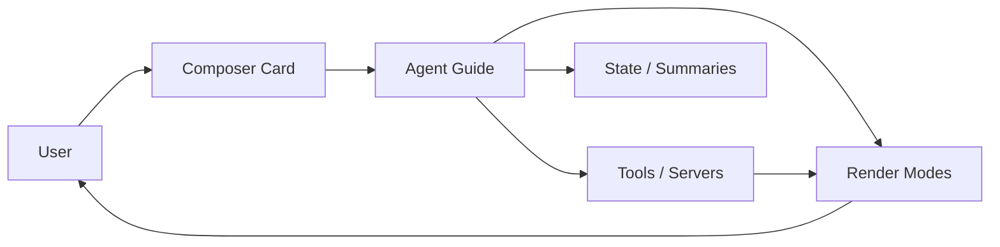

# Agent Guide Design Spec

A compact reference for designing an agent that works with the user through chat, custom composer cards, and transparent multi-step flows.

## Document Map

| File | Topic |
|------|-------|
| [01-agent-guide.md](01-agent-guide.md) | What the agent guide is, thinking/access modes, boundaries |
| [02-composer-cards.md](02-composer-cards.md) | Custom composer cards (variants, secrets, forms) |
| [03-chat-render-modes.md](03-chat-render-modes.md) | Chat render modes (thinking, searching, connecting, etc.) |
| [04-multi-step-flow.md](04-multi-step-flow.md) | Multi-step flows, checkpoints, observability |
| [05-state-and-summarization.md](05-state-and-summarization.md) | State, tool discovery, summarization, resuming |
| [06-ux-patterns.md](06-ux-patterns.md) | Cross-cutting UX patterns |

## Glossary

- **Agent guide** — The internal behavior contract that decides how the agent thinks, accesses tools, and asks for help.
- **Composer card** — A custom input widget that replaces the default chat composer for specific interactions.
- **Render mode** — A visual/animated state shown in the chat while the agent is doing something.
- **Checkpoint** — A planned pause where the agent stops and waits for user input or approval.
- **State snapshot** — A serialized view of the agent's plan, memory, and pending actions at a given moment.

